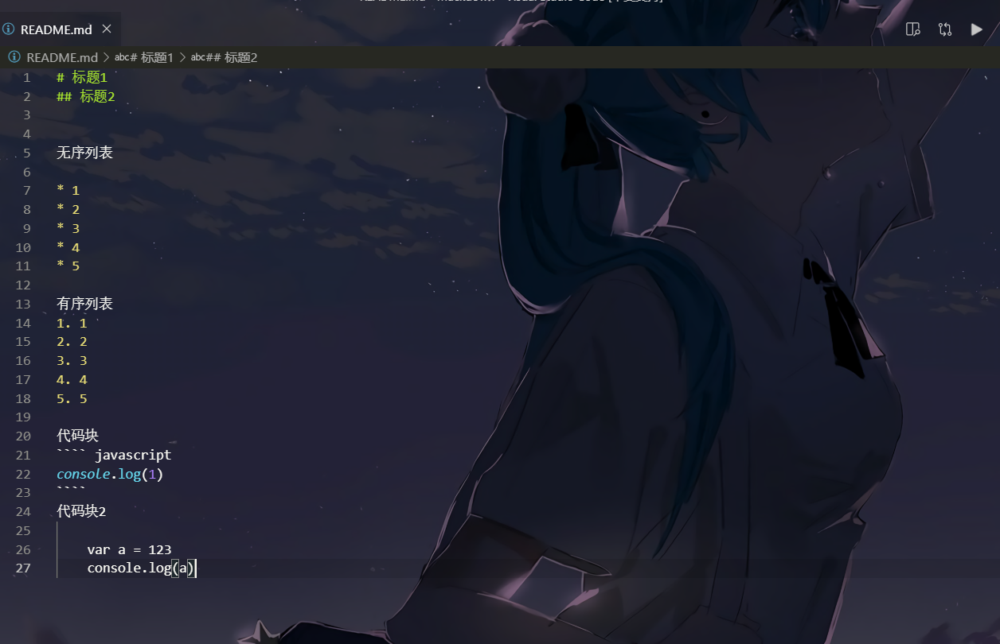

# 标题1
## 标题2


无序列表

* 1
* 2
* 3
* 4
* 5

有序列表
1. 1
2. 2
3. 3
4. 4
5. 5

代码块
```` javascript
console.log(1)
````
代码块2 

    var a = 123
    console.log(a)


图片



链接

[点我去百度](https://www.baidu.com)
